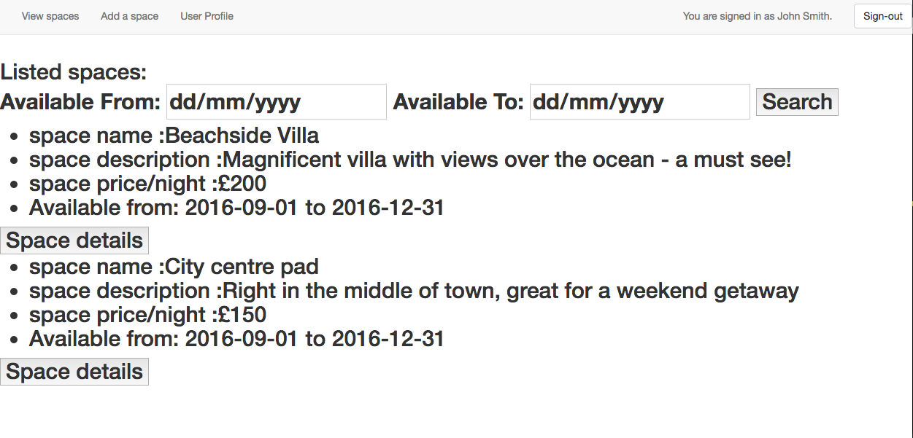

# inglourious-BnBsterds

### Objectives of project

Makers Academy lab week group project where the aim was to recreate AirBnB using Ruby and Sinatra.

### Design Process

Design docs, model diagrams and user stories are available [here](/design_process.md).

### Technologies used

- Ruby
- Sinatra
- DataMapper
- Capybara
- Rspec
- CSS (Bootstrap)
- HTML

### How to run it

Clone repo to a local directory:

``$ git clone git@github.com:samjbro/inglourious-BnBsterds.git``

Run sinatra server:

``$ rackup``

Navigate to:

``localhost:9292``

Alternatively the app is deployed to [Heroku](https://inglourious-bnbsterds.herokuapp.com/)
